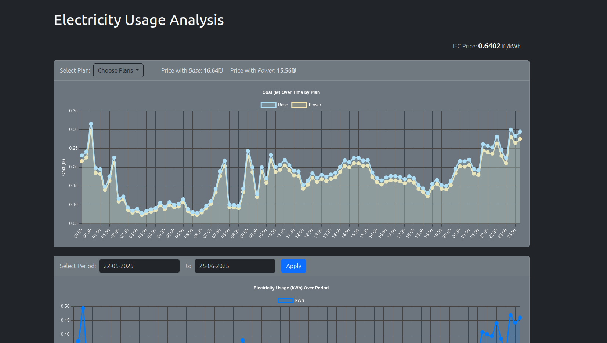

# Electricity Analyser Dashboard



A web-based dashboard for analyzing electricity usage from IEC data. Visualize your consumption with interactive graphs, compare different pricing plans, and choose the best option for your needs.

## Features

- Import and analyze IEC electricity usage data
- Interactive graphs for usage trends and breakdowns
- Apply and compare custom electricity plans
- Identify the most cost-effective plan for your usage
- User-friendly web interface

## Getting Started

### Prerequisites

- [Docker](https://www.docker.com/get-started) installed on your system

### Installation
1. Create a directory named `electricity-analyser`: 
    ```bash
    mkdir electricity-analyser
    ```

2. Run the container using docker: 
    ```bash
    docker run -p 5000:5000 -v $(pwd)/electricity-analyser:/config adarwa/electricity-analyser:latest
    ```

3. Access the dashboard at [http://localhost:5000](http://localhost:5000)

## Usage

1. Upload your IEC electricity usage file(can be requested in the IEC dashboard online).
3. Define plans in config.yaml(can be edited via the dashboard). By default the plans are from Electra Power.
2. View your consumption data in interactive graphs.
3. Add or select custom electricity plans.
4. Compare costs and choose the best plan for your usage.

## Contributing

Contributions are welcome! Please open issues or submit pull requests.

## License

This project is licensed under the MIT License.
